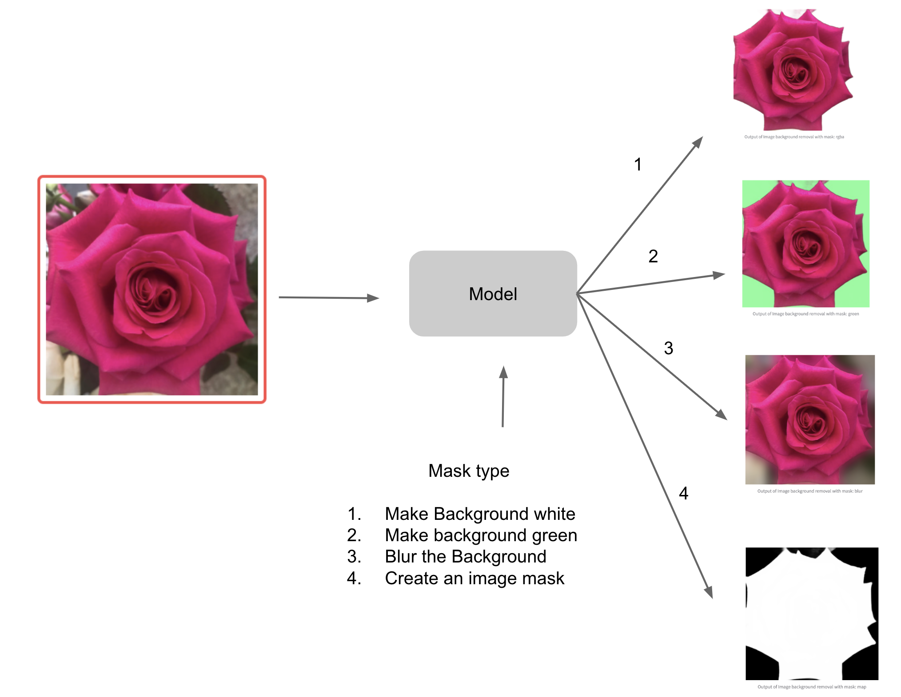

# Contributions to Open Research

-  - _ML Concepts explained in under a minute with accompanying notebook and notebook code walkthrough_

-  - _Highlighting the work of SOTA reseachers & practitioners who publish code, models, app & notebooks (in some cases) for a paper_
-  - _Discover and compare SOTA solutions for tasks with a few keystrokes/clicks_

 -  -   _**Free APIs** for tasks using SOTA models (with permissive licenses). Please use for evaluation only to avoid overwhelming servers_
 
 -  - _demo apps hosted on [TWC servers](https://taskswithcode.com/sentence_similarity) and/or on [Hugging Face](https://huggingface.co/taskswithcode)_
 -  - _notebooks in Google colab_
 -  - _Github repos with experiments that are work in progress_
 -  - _Aperiodic newsletters on [Ghost](https://taskswithcode.ghost.io/) and [Medium](https://medium.com/taskswithcode)_

### Tasks solved using SOTA models
1. [Image background removal -  API available now ](#image-background-removal)
2. [Video background removal ](#video-background-removal)
3. [Classifying the dominant object in the foreground of an image](#foreground-object-classification)
4. [Detecting multiple objects within an image](#detecting-multiple-objects-within-images)
5. [Image Captioning](#image-captioning)
6. [Video quality assessment](#video-quality-assessment)
7. [Learning image embeddings](#self-supervised-image-representations)
8. [Sentence embeddings for Semantic search, similarity, and clustering](#sentence-embeddings)
9. [Exploratory tasks](#exploratory-tasks)

### Image Background Removal

  
   

### Current endpoint
-  for Image background removal. API usage illustrated in    & 
#### SOTA model for this task
- [InSPyReNet fork](https://github.com/taskswithcode/InSPyReNet)
   -   & 
   - [Evaluate in Colab](https://colab.research.google.com/github/taskswithcode/InSPyReNet/blob/master/TWCSOD.ipynb) 

### Video Background Removal

  
   

### Current endpoint

- [Notebook](https://colab.research.google.com/github/taskswithcode/InSPyReNet/blob/master/TWCSOD.ipynb) 

#### SOTA model
- [InSPyReNet fork](https://github.com/taskswithcode/InSPyReNet)
  - [Evaluate in Colab](https://colab.research.google.com/github/taskswithcode/InSPyReNet/blob/master/TWCSOD.ipynb) 

### Foreground object classification

  
   

### Current endpoint

- [ Compare two model outputs (SimMIM & VIT base) in Colab](https://colab.research.google.com/github/taskswithcode/SimMIM/blob/master/TWCSimMim.ipynb)  
  - Classifies input image into one of [1000 classes](https://github.com/taskswithcode/SimMIM/blob/main/imagenet_code_to_label_map.txt)

#### SOTA model
- [SimMIM fork](https://github.com/taskswithcode/SimMIM)
  - [Evaluate in Colab](https://colab.research.google.com/github/taskswithcode/SimMIM/blob/master/TWCSimMim.ipynb)  

### Detecting multiple objects within images

  
   

### Current endpoint
- Compare models through separate apps (Detic & OWL-ViT)
  - .  Detic Model
  -  OWL-ViT model

#### SOTA models
- [GRiT fork](https://github.com/taskswithcode/GriT)
  - [Evaluate in Colab](https://colab.research.google.com/github/taskswithcode/GRiT/blob/master/TWCGRiT.ipynb)  

### Image Captioning
-  OWL-ViT model

#### SOTA models
-  GRIT fork [Evaluate in Colab](https://colab.research.google.com/github/taskswithcode/GRiT/blob/master/TWCGRiT.ipynb)  

### Video quality assessment

- DOVER fork  [Evaluate in Colab](https://colab.research.google.com/github/taskswithcode/DOVER/blob/master/TWCDOVER.ipynb)  

### Self-supervised image representations

-  [MAE fork Evaluate in Colab](https://colab.research.google.com/github/taskswithcode/mae/blob/master/TWCMAE.ipynb)  

### Sentence embeddings

#### Tasks
- Sentence Similarity Comparison app    & 
-  Semantic Search Comparison app    & 
-   Semantic Clustering Comparison app    & 

#### SOTA models
- [SimCSE fork -  👨‍💻 for use in comparison app ](https://github.com/taskswithcode/SimCSE)
- [SGPT fork -  👨‍💻 for use in comparison app ](https://github.com/taskswithcode/sgpt)
- [DCPCSE fork -  👨‍💻 for use in comparison app ](https://github.com/taskswithcode/DCPCSE)
- [OpenAI embeddings wrapper 👨‍💻](https://github.com/taskswithcode/openai_api)
- [🤗 Hugging Face models wrapper 👨‍💻  for comparison app](https://github.com/taskswithcode/sentence_similarity_hf_model)

### Exploratory tasks

-  [Latent Diffusion fork with Colab notebook](https://colab.research.google.com/github/taskswithcode/latent-diffusion/blob/master/TWCLatentDiffusion.ipynb)     
- [Taming Transformers fork with Colab notebook](https://colab.research.google.com/github/taskswithcode/taming-transformers/blob/master/TWCTamingTransformer.ipynb)  

